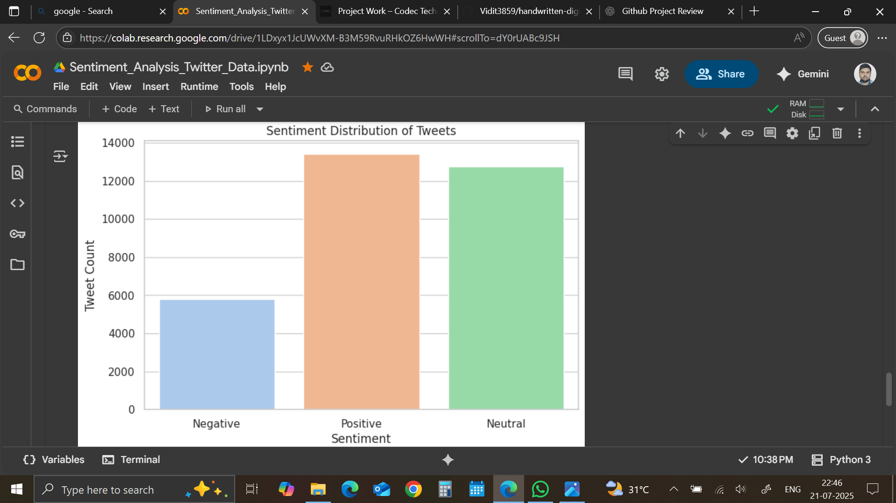
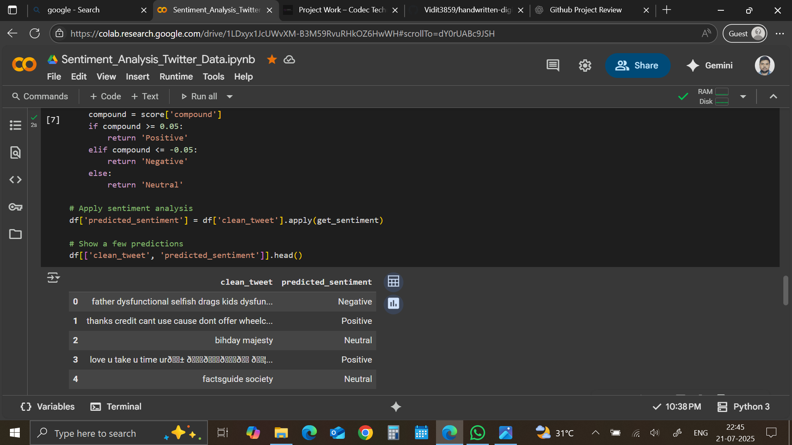
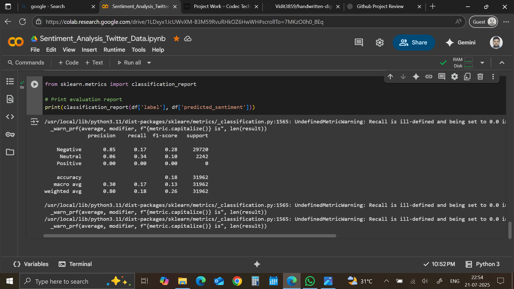

# Sentiment Analysis on Twitter Data  📊

This project performs sentiment analysis on real-world tweets using **Natural Language Processing (NLP)** techniques. Tweets are classified as **Positive**, **Negative**, or **Neutral** using **NLTK's VADER Sentiment Analyzer**.

---

## 📌 Project Highlights

- Cleaned tweet data (removed mentions, hashtags, URLs, stopwords, etc.)
- Applied **VADER** for rule-based sentiment scoring
- Visualized sentiment distribution using **Seaborn**
- Evaluated performance using **classification report** (Precision, Recall, F1-score)
- Built entirely using **Google Colab** (easy to run)

---

## 📁 Files in This Repo

- `Sentiment_Analysis_Twitter_Data.ipynb` – Main Colab notebook
- `README.md` – Project overview
- `assets/` — Folder for screenshots (see below)

---

## 🛠️ Technologies Used

- Python
- NLTK (VADER)
- Pandas
- Matplotlib & Seaborn
- Scikit-learn

---

## ▶️ How to Run

1. Open the `.ipynb` notebook in **Google Colab**
2. Run all cells from top to bottom
3. No local setup needed — all required libraries are auto-installed

---

## 📊 Sample Output

- Cleaned tweets
- Predicted sentiments: Positive / Negative / Neutral
- Sentiment Distribution Plot
- Classification Report with Precision, Recall, F1-score

---

## 📸 Screenshots

### 🔹 Sentiment Distribution Plot

### 🔹 Sample Predictions Table

### 🔹 Model Evaluation Report

---

## ✨ Future Improvements

- Integrate Twitter API for real-time tweet analysis
- Train custom ML model (Logistic Regression, Naive Bayes)
- Compare with SpaCy or TextBlob for sentiment scoring

---

## 🤝 Internship Info

This project was completed as part of the **AI Internship Program at Codec Technologies**.

---

## 🚀 Author

- 👤 **Vidit Kumar**
- 📅 July 2025
- 🌐 [GitHub Profile](https://github.com/Vidit3859)

---

## 📎 Link to Project

🔗 [View the notebook on GitHub](https://github.com/Vidit3859/twitter-sentiment-analysis)
